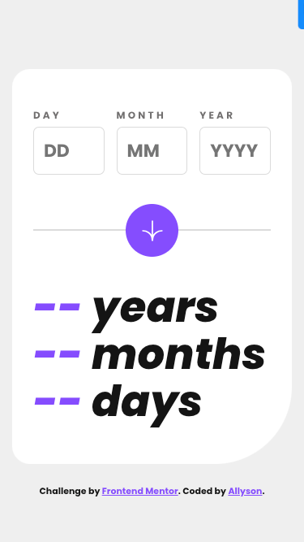
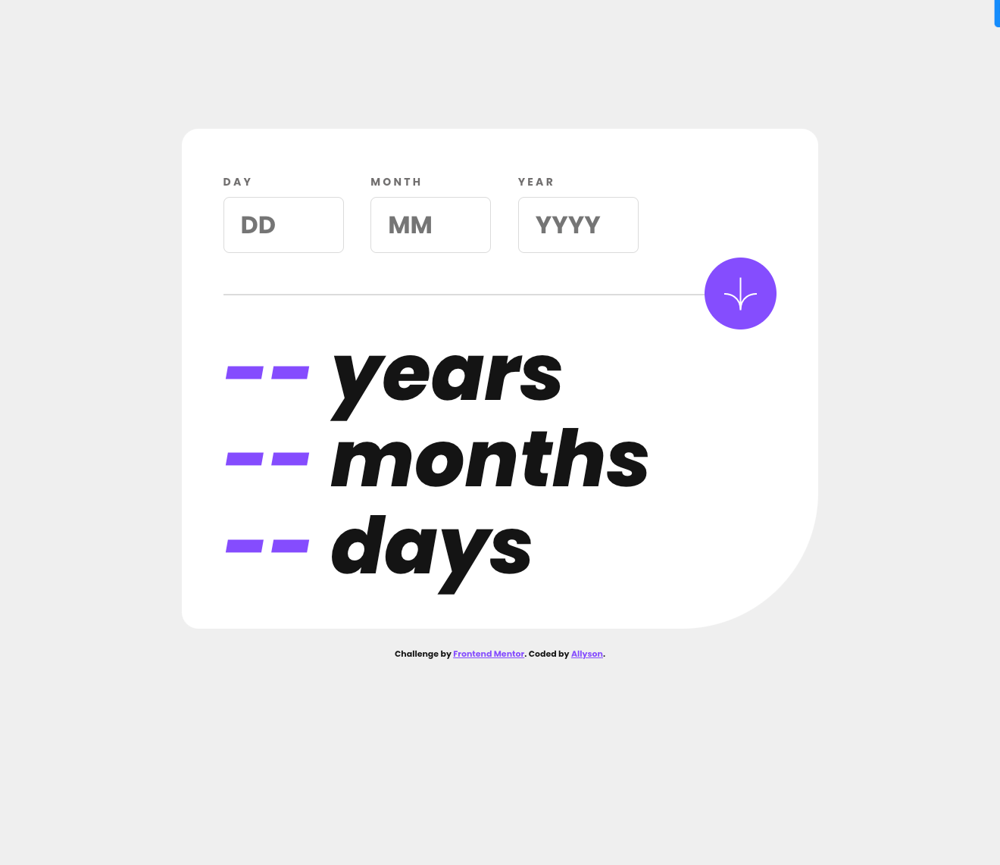

# Frontend Mentor - Age calculator app solution

This is a solution to the [Age calculator app challenge on Frontend Mentor](https://www.frontendmentor.io/challenges/age-calculator-app-dF9DFFpj-Q). Frontend Mentor challenges help you improve your coding skills by building realistic projects.

## Table of contents

- [Overview](#overview)
  - [The challenge](#the-challenge)
  - [Screenshot](#screenshot)
  - [Links](#links)
- [My process](#my-process)
  - [Built with](#built-with)
  - [What I learned](#what-i-learned)
  - [Continued development](#continued-development)
  - [Useful resources](#useful-resources)
- [Author](#author)
- [Acknowledgments](#acknowledgments)

## Overview

### The challenge

Users should be able to:

- View an age in years, months, and days after submitting a valid date through the form
- Receive validation errors if:
  - Any field is empty when the form is submitted
  - The day number is not between 1-31
  - The month number is not between 1-12
  - The year is in the future
  - The date is invalid e.g. 31/04/1991 (there are 30 days in April)
- View the optimal layout for the interface depending on their device's screen size
- See hover and focus states for all interactive elements on the page
- **Bonus**: See the age numbers animate to their final number when the form is submitted

### Screenshot





### Links

- Solution URL: [Github Link](https://github.com/allyson-s-code/age-calculator)
- Live Site URL: [Age Calculator](https://allyson-s-code.github.io/age-calculator/)

## My process

I started by looking over the requirements and design files to get a general idea of the functionality of the app. Then, I built out the HTML keeping accessibilty and the interactive elements in mind. I switched gears by working on the form validation and age calculation functions using JS. Styling with CSS came next, as well as lots of testing to ensure the app worked on various screen sizes and with different user input scenerios.

### Built with

- Semantic HTML5 markup
- CSS custom properties
- Flexbox
- Mobile-first workflow
- JavaScript

### What I learned

The Age Calculator App was a good challenge for reviewing and reinforcing JavaScript and form validation, especially working with dates, which I struggle with.

As always problems arose with edge cases. For example, if a user input was valid and calculated and then one of the inputs changed and was no longer valid the error messages showed as expected, but the age output remained from the first valid entry. To account for this I added the `resetOutput()` function at the top of the `addError()` function.

Another issue I had was that the age was being calculated even when there were errors. Thanks to ChatGPT I learned that my `isValidDate()` function was only checking if the date string could be converted into a valid JS Date object- not whether the date components from the inputs were valid when combined. For this I added additional checks to ensure validity:

```js
function isValidDate(day, month, year) {
  const maxDaysInMonth = daysInMonths[month - 1];
  return (
    !isNaN(year) &&
    !isNaN(month) &&
    !isNaN(day) &&
    month >= 1 &&
    month <= 12 &&
    day >= 1 &&
    day <= maxDaysInMonth
  );
}

//...

function validate(dayInput, monthInput, yearInput) {
  //...

  // Check overall validity of date
  if (!isValidDate(dayValue, monthValue, yearValue)) {
    addError(dayInput, errorMessages.invalidDate);
  } else {
    removeError(dayInput);
    calculateAge(dayValue, monthValue, yearValue);
  }
}
//...
```

With the styling I learned a new outcome of forms and browser settings. My `fieldset` was larger than it's parent div and to rectify this I learned from my research that I should add a property of `min-width: 0;` to the `fieldset`.

As a bonus for this project I added animation to the age output which was a lot of fun. I love how dynamic it makes the app.

I also learned that values of `border-radius` in percentages can stretch and sometimes it's better to use set measurements like `px`.

### Continued development

I want to continue sharpening my JS skills and including accessibilty best practices. I'm also really interested in growing my CSS and animation skills.

### Useful resources

- [CodingDesign Number Counting Animation](https://www.youtube.com/watch?v=WfDIU93fN3o) -
- [CSS-tricks Animating Number Counters](https://css-tricks.com/animating-number-counters/) - This article by Carter Li gives some cool CSS alternatives to the JS animation.

## Author

- Website - [Allyson Smith](https://smithstudio.dev/)
- Frontend Mentor - [@allyson-s-code](https://www.frontendmentor.io/profile/allyson-s-code)

## Acknowledgments

Thanks so much to Jeet Saru at CodingDesign and your super helpful YouTube video on Number Counting Animation!
